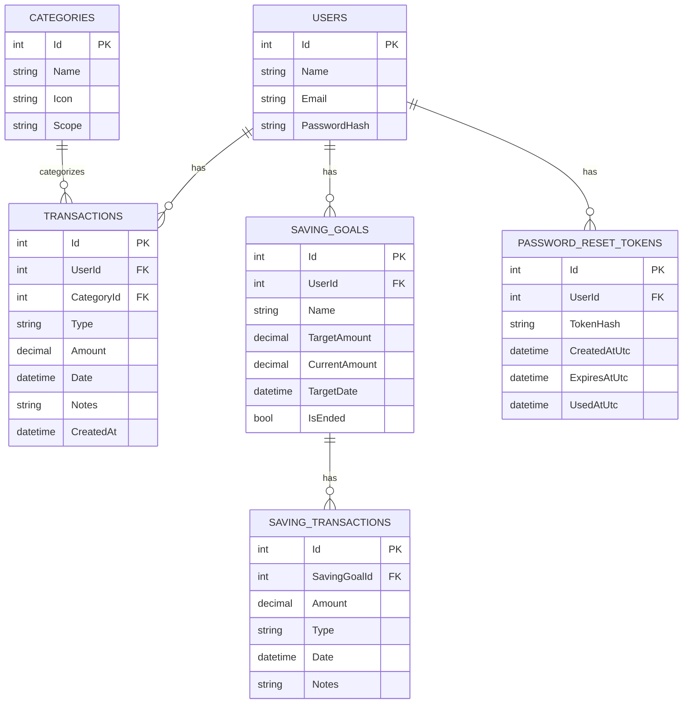

## Spendy Mobile — Complete System Documentation / Research Paper

### Introduction (System Overview & Purpose)
Spendy is an **offline-first personal finance tracker** built with **.NET MAUI**. It helps users record income and expenses, view daily transaction lists on the dashboard, and browse a **calendar-based daily transaction viewer** for any date in a selected month. All user data is stored locally (SQLite), enabling usage without internet connectivity.

### Uses / Objectives
- **Track expenses and income** quickly with minimal friction.
- **Show day-by-day history** using a calendar to review spending and earnings.
- **Remain fast and stable** on lower-end devices by avoiding UI-thread blocking work.
- **Work fully offline** (no Firebase / no Google Sign-In required).

### Purpose (Budget Tracking System)
Spendy is a **budget tracking system** designed to help users:
- Understand where their money comes from (income sources)
- Understand where their money goes (expense categories)
- Build daily tracking habits through a simple, minimal UI

### Target Users
- Students and individuals tracking allowance/salary
- Anyone who needs a **simple offline** income/expense tracker
- Users with limited connectivity who want local-only storage

### System Modules
- **Authentication**
  - Local sign-in and session persistence using a local SQLite user store.
  - Offline password reset supported in-app (updates the local password hash).
  - Google Sign-In: **not included in the current offline build** (removed to keep the system fully offline and stable).
- **Dashboard (Daily Transactions)**
  - Displays available balance and a daily list of transactions (expense/income mode).
  - Quick add transaction flow.
- **Calendar (Daily Transaction Viewer)**
  - Month picker + month navigation.
  - Tap a day to see:
    - In **Income dashboard**: income totals + income breakdown
    - In **Expense dashboard**: expense totals + expense breakdown
  - Removed all “Highest Spending Day / Highest Income Day” analytics UI.
- **Transactions**
  - Adds income/expense records with category, amount, notes, and timestamp.
  - Stores and reads transactions from SQLite through the data service layer.
- **Transaction History (All-time)**
  - A dedicated screen showing **all past transactions** for the current mode (Income or Expense), newest first.
- **Currency & Formatting**
  - Centralized currency symbol/culture formatting for consistent UI output.
- **Navigation**
  - Central navigation service manages stack transitions (sign-in flow, dashboard, add transaction, etc.).
- **Settings**
  - Currency preference
  - Language selection: **removed** (app is English-only)
  - Profile/account information
  - Session management (logout)

### Features & Functionalities
- **Offline-only operation**
  - No reliance on external services for login, sync, or password reset.
- **Daily transaction list**
  - Shows category, icon, amount, and time.
- **Calendar daily breakdown**
  - Month view with day cells showing expense/income indicators.
  - Day detail view with totals and category breakdown lists.
- **Smooth UI transitions**
  - Splash animation tuned so the “Spendy” wordmark fades in without noticeable delay.
- **Remember Me**
  - When enabled, the app persists the **session** (so the user stays signed in on next launch).
  - The app can also pre-fill the last used email (non-sensitive) for a smoother login UX.
- **Performance improvements**
  - Startup DB initialization runs in the background to avoid UI freezes.
  - Calendar day selection avoids reloading month statistics on every tap (instant response).
  - Calendar day detail opens as an overlay to prevent layout clipping and ensure visibility.

### System Architecture / Flow
- **UI Layer (Views + XAML)**
  - Pages and views bind to view models via MVVM.
- **ViewModel Layer**
  - Handles state, commands, and async loading.
  - Responds to data change events and updates observable collections.
- **Service Layer**
  - `ISpendyDataService` provides transaction queries and summaries.
  - Implements day-level breakdown (`GetDayBreakdownAsync`) for the calendar detail view.
- **Data Layer**
  - SQLite database accessed via Entity Framework Core.
  - Entities include users, transactions, and categories.

**Typical runtime flow**
- App starts → Splash runs a short animation → user proceeds to onboarding/sign-in.
- After sign-in, dashboard loads:
  - available balance
  - daily summary + list
- User opens calendar overlay:
  - selects month
  - taps a day → shows totals and breakdown for that day
  - taps Back → returns to the month grid, or Close → returns to dashboard
- User can open **History** to view all past transactions (Income-only or Expense-only depending on dashboard mode).

### Database Design
Spendy uses **SQLite** via **Entity Framework Core**.

#### Core tables (based on current entities)
- **Users**
  - `Id` (PK)
  - `Name`
  - `Email` (unique)
  - `PasswordHash`
  - Profile fields (phone, birthday, etc.)
- **Categories**
  - `Id` (PK)
  - `Name`
  - `Icon`
  - `Scope` (Income / Expense)
- **Transactions**
  - `Id` (PK)
  - `UserId` (FK → Users)
  - `CategoryId` (FK → Categories)
  - `Type` (Income / Expense)
  - `Amount`
  - `Date`
  - `Notes`
  - `CreatedAt`
- **SavingGoals**
  - `Id` (PK)
  - `UserId` (FK → Users)
  - `Name`, `TargetAmount`, `CurrentAmount`, `TargetDate`, `IsEnded`
- **SavingTransactions**
  - `Id` (PK)
  - `SavingGoalId` (FK → SavingGoals)
  - `Amount`, `Type` (Save/Withdraw), `Date`, `Notes`
- **PasswordResetTokens**
  - `Id` (PK)
  - `UserId` (FK → Users)
  - `TokenHash`, `CreatedAtUtc`, `ExpiresAtUtc`, `UsedAtUtc`

#### ERD (Entity Relationship Diagram)


### Use Case Diagram
```mermaid
flowchart LR
  U((User))
  U --> A[Register account]
  U --> B[Sign in]
  U --> C[Add income]
  U --> D[Add expense]
  U --> E[View dashboard (income/expense)]
  U --> F[Open calendar]
  U --> G[Select month]
  U --> H[Select day to view breakdown]
  U --> K[Open all-time history]
  U --> I[Update profile/settings]
  U --> J[Logout]
```

### System Flow / User Guide
- **Register**
  - Open app → Sign up → enter name, email, password → create account.
- **Login**
  - Open app → Sign in → enter email + password → sign in.
  - If **Remember me** is enabled, the app can keep the session for the next launch and may prefill the last used email.
- **Add Income / Expense**
  - From dashboard, tap **+**
  - Choose mode (income/expense), category, amount, date, notes → save.
- **View Dashboard**
  - Toggle between **Expenses** and **Income**
  - Review today’s list and totals.
- **Use Calendar (History View)**
  - Tap the calendar icon
  - Navigate to month
  - Tap a day → see totals + category breakdown for the current dashboard mode.
- **View All-time History**
  - From dashboard, open the **History** screen (Income history or Expense history based on current mode).
  - Browse all past transactions (newest first).
- **Settings**
  - Update profile info, change currency preferences, logout.

### Security / Privacy Model
- **Offline-first**: all data is stored locally on the device (SQLite).
- **Passwords**: stored as a **hash** (not plaintext).
- **Remember Me**: implemented as session persistence + optional remembered email (non-sensitive).

### Performance / Stability Notes
- Avoid blocking the UI thread during startup (DB initialization is backgrounded).
- Debounced refresh logic prevents repeated DB refresh storms.
- Calendar/day detail avoids full month reloads on every tap.

### Technologies Used
- **.NET MAUI**: Cross-platform UI framework.
- **C# / MVVM**: App architecture using observable properties and commands.
- **CommunityToolkit.Mvvm**: Source-generated MVVM helpers.
- **SQLite + EF Core**: Local storage and querying.

### Conclusion / Summary
Spendy is designed to be a **simple, fast, and reliable offline finance tracker**. The calendar is intentionally focused on **transaction history**, not analytics, enabling users to review any day’s income/expense totals and category breakdown without complex statistics or online dependencies.

