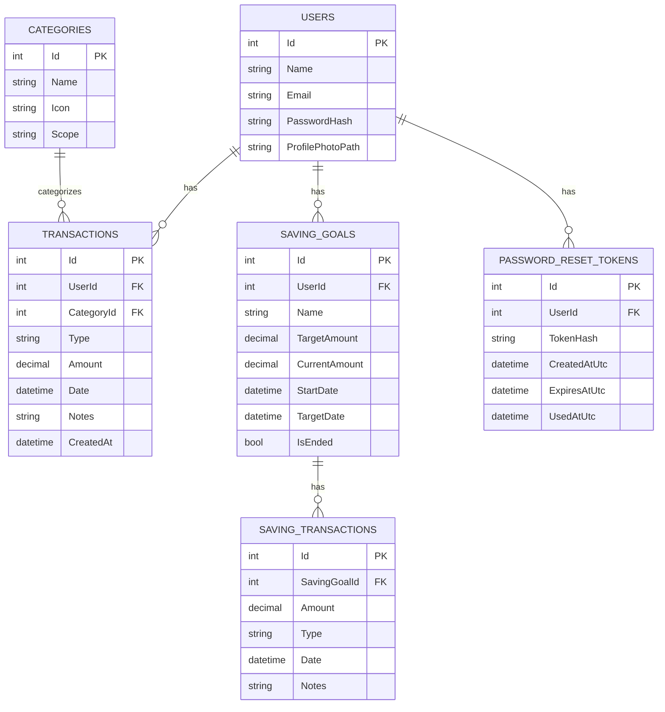
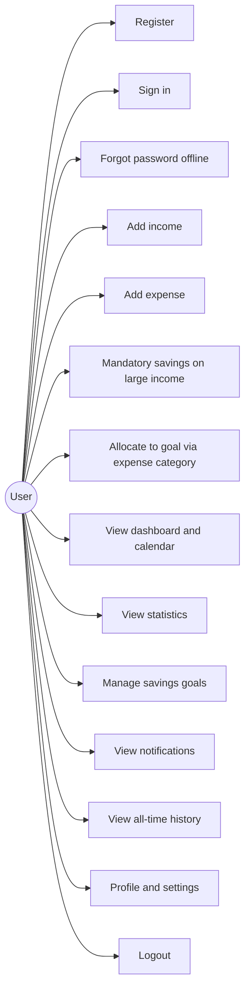

## Spendy Mobile — System Documentation

### Introduction (System Overview & Purpose)
Spendy is an **offline-first personal finance tracker** built with **.NET MAUI**. It helps users record income and expenses, view daily activity on the **Home** dashboard, explore **monthly patterns** on the **Statistics** tab, and manage **saving goals** (create plans, deposit/withdraw, track progress). All user data is stored locally in **SQLite**; there is no cloud sync in the current build.

### Uses / Objectives
- **Track expenses and income** with categories, amounts, dates, and notes.
- **Review history** via dashboard calendar, full transaction history, and statistics charts.
- **Allocate funds** to savings goals—including optional **mandatory savings** on large income entries—and record movements per goal.
- **Remain responsive** on lower-end devices by avoiding unnecessary UI-thread blocking (debounced refreshes, background-friendly loading patterns).
- **Work fully offline**: local accounts, local password reset, no Google Sign-In or external auth providers.

### Purpose (Budget Tracking System)
Spendy is a **budget tracking system** that helps users:
- See where money comes from (income categories) and where it goes (expense categories).
- Maintain **available balance** that reflects income, expenses, and savings movements.
- Build habits through a **tab-based** layout: Home, Statistics, Savings, and Settings.

### Target Users
- Students and individuals tracking allowance or salary.
- Anyone who wants a **simple, local-only** income/expense and savings app.
- Users with limited or no connectivity.

### Application Structure & Navigation
- **Cold start:** `App` opens a `NavigationPage` whose root is **Splash** → the stack then continues to **Get Started** → **Sign In** (and optionally **Sign Up** or **Forgot password** on top of that stack). The app **does not** auto-skip the sign-in screen; a successful **Sign in** (or **Sign up** after registration) transitions to the main experience.
- **After authentication:** the window is replaced with **`AppShell`**, a single `Shell` host whose only content is **`MainShellPage`**. The shell’s flyout and default tab bar are **hidden**; the main UI uses a custom bottom **Spendy** tab bar (four columns: **Home**, **Statistics**, **Savings**, **Settings**).
- **In-app navigation:** secondary screens (add transaction, history, profile, plan detail, notifications, etc.) are pushed on **`Shell.Current.Navigation`**, not as extra shell tabs.
- **Logout:** from **Settings**, logout clears the session and returns to a full-screen **Sign In** stack (no bottom nav).
- **Session & Remember me:** **Remember me** (on sign-in) controls whether the user id is **persisted** for the next launch and can **prefill the last email**; the user still goes through **Splash → Get Started → Sign In** and must **sign in explicitly** (no automatic jump to the main shell on launch).

### System Modules

#### Authentication (pre–main shell)
- **Sign up:** first/last name, email, birthday, password (with policy/strength feedback), terms acceptance; on success, session is established and **AppShell** opens.
- **Sign in:** email + password, **Remember me** toggle, link to **Sign up** and **Forgot password**.
- **Forgot password (offline):** local flow that updates the password in SQLite (no email server). Aligned with `PasswordResetTokens` in the database.
- **Password policy:** enforced on register, reset, and change-password paths.

#### Home (Dashboard) — first tab
- **Expense / Income mode** toggles the **current day** summary, list, history, and calendar **for that kind only**.
- **Available balance** and a **greeting** (from the user’s display name when present).
- **Transaction list** for the selected day (today by default) with category, amount, and time.
- **Quick add (`+`):** opens **Add transaction** with the mode implied by the dashboard (income vs expense).
- **Calendar overlay (“monthly view”):** month navigation, per-day totals for the selected kind, tap a day for **totals + category breakdown**; **Back** returns to the month grid; closing the overlay returns to the normal dashboard.
- **Transaction history:** push **All-time history** for the **current mode** (expense history vs income history), newest first.
- **Notifications entry:** bell opens the in-app **Notifications** page (same as other tabs).

**Rule:** **Expenses are blocked until at least one income transaction exists** (“add income first”). The add-transaction screen also enforces this when switching to expense mode.

#### Statistics — second tab
- **Expense / Income mode** for the selected calendar month.
- **Monthly chart** (bar-style visualization) and **category breakdown** for that month.
- **Month/year picker** overlay to choose the reporting period.
- **Available balance** and profile/header patterns consistent with Home.

#### Savings — third tab
- **Saving goals (plans):** list of active plans with progress text; tap a plan for **Save plan detail** (progress, **save** / **withdraw** movements when allowed, transaction history list).
- **Add plan:** name, target amount, **start date** and **target date** (calendar-based selection).
- **Edit plan** from the list row.
- **Ended:** link to **Ended savings** for goals marked ended/finished.
- **Mandatory savings (linked from income):** when **income** is at or above the app threshold (**₱20,000** in code), saving **2%** of that income is required before the income is finalized; a **modal allocation** flow lets the user pick which active goal receives the mandatory amount (implemented via `AddIncomeWithMandatorySavingsAsync`).

#### Transactions (Add transaction page)
- **Modes:** expense vs income; **category** pickers per kind.
- **Date:** day-of-month within the current calendar month.
- **Expense → “Savings goal” category:** if the user picks the built-in **Savings goal** expense category, they must have at least one active goal; the app checks **available balance**, then asks **which goal** should receive the deposit (same ledger as saving from the Savings tab).
- **Large income:** triggers **mandatory savings** allocation (see above) instead of a plain income row only.

#### Notifications (in-app, not push)
Derived from current data, including:
- **Savings goal deadlines** within **14 days** (including “ends today” / “tomorrow”).
- **Balance warnings:** negative balance, low balance (under **₱500**), and **overspending this month** when total expenses exceed total income for the current month.

#### Settings — fourth tab
- **Profile:** opens **Profile** page (name, contact fields, photo via profile photo service, etc.).
- **Currency:** **PHP** or **USD** (drives symbols and formatting via `CurrencyService`).
- **Change password:** current + new + confirm with strength indicator.
- **Developer (Debug builds only):** copy SQLite path to clipboard and guidance for opening `spendy.db` (e.g. DB Browser).
- **Logout:** clears session and returns to sign-in stack.

### Features & Functionalities (Summary)
| Area | Capability |
|------|------------|
| Data | SQLite + EF Core; initializer ensures schema/columns (including legacy upgrades), seeds categories when needed |
| Home | Day list, balance, expense/income toggle, calendar + day detail, all-time history |
| Statistics | Monthly chart + categories, month/year picker |
| Savings | Goals with start/target dates, detail/history, ended plans, mandatory allocation on large income |
| Auth | Local register/sign-in, offline forgot-password flow, remember-me persistence semantics |
| UX | Custom tab bar, modal mandatory savings, debounced data refresh, splash DB init before auth |

### System Architecture / Flow

#### Layers
- **UI:** XAML `ContentView` / `ContentPage` + bindings to view models (MVVM).
- **ViewModels:** `CommunityToolkit.Mvvm` (`ObservableProperty`, `RelayCommand`), collections for lists.
- **Services:** `ISpendyDataService` (transactions, dashboard, statistics, day breakdown, history, savings CRUD and movements, mandatory-income flow), `IAuthService`, `IUserSession`, `ICurrencyService`, `IProfilePhotoService`, navigation helpers in `AppNavigation`.
- **Data:** `SpendyDbContext`, entities (`User`, `Category`, `Transaction`, `SavingGoal`, `SavingTransaction`, `PasswordResetToken`), `SpendyDbInitializer` for `EnsureCreated` and guarded `ALTER`/indexes.

#### Typical runtime flow (signed-in)
1. User selects **Home** tab → dashboard loads with debounced refresh from `_data`.
2. User adds a transaction → `DataChanged` propagates; dashboard/statistics/savings refresh as needed.
3. User opens **Statistics** → month stats query for the chosen kind.
4. User opens **Savings** → plans list; opens detail → optional save/withdraw; optional **Ended** list.
5. User changes **currency** in **Settings** → formatting updates app-wide.

### Database Design
Spendy uses **SQLite** via **Entity Framework Core**. The initializer may add columns/tables on older databases (e.g. `SavingGoals.StartDate`, profile paths, password reset tokens).

#### Core tables (current model)

**Users** — `Id`, `Name`, `Email` (unique), `PasswordHash`, `Phone`, `Birthday`, `Gender`, `Address`, `Handle`, `ProfilePhotoPath`

**Categories** — `Id`, `Name`, `Icon`, scope (income vs expense). Includes app-managed categories such as the **Savings goal** expense category.

**Transactions** — `Id`, `UserId`, `CategoryId`, `Type` (income/expense), `Amount`, `Date`, `Notes`, `CreatedAt`

**SavingGoals** — `Id`, `UserId`, `Name`, `TargetAmount`, `CurrentAmount`, **`StartDate`**, `TargetDate`, `IsEnded`

**SavingTransactions** — Movements linked to a goal (`Save` / `Withdraw` semantics in app logic)

**PasswordResetTokens** — Offline reset token metadata (`TokenHash`, expiry, used timestamp)

#### ERD (Entity Relationship Diagram)

### Use Case Diagram (High Level)

### System Flow / User Guide

- **First launch / returning user**
  - **Splash** runs SQLite initialization and a short animation → **Get Started** → **Sign In**.
  - Complete **Sign in** (or **Sign up**) to enter **AppShell** with four tabs.

- **Daily tracking (Home)**
  - Toggle **Expenses** vs **Income** → review list and summary for **today**.
  - Tap **+** → add transaction (respecting “income first” for expenses).
  - Open **calendar** → change month, tap a day → see breakdown → back or close.

- **Statistics**
  - Choose **Expenses** or **Income**, pick **month/year**, read chart and category list.

- **Savings**
  - Tap **+** to create a plan (dates + target).
  - Tap a plan → **save** or **withdraw**, view history; use **Edit** or **Ended** as needed.

- **Large income**
  - If income ≥ **₱20,000**, complete the **mandatory 2%** allocation modal toward a goal before the entry is saved.

- **Settings**
  - **Profile**, **currency**, **password**, **logout**; in Debug, optional SQLite path copy.

### Security / Privacy Model
- **Local-only** storage (SQLite on device).
- **Passwords** stored as **hashes**, not plaintext.
- **Remember me** persists session preference and optional email; user still authenticates on each fresh launch via the sign-in action.

### Performance / Stability Notes
- **Splash** performs database setup before the auth stack to reduce races with migrations.
- **Debounced** refresh on data events reduces redundant DB work.
- **Calendar day selection** updates the day detail without reloading full month statistics on every tap.
- **Warnings during build** (e.g. MVVM toolkit **MVVMTK0045**, XAML **XC0022**) are compile-time hints; they do not block release builds by default.

### Technologies Used
- **.NET MAUI** — cross-platform UI.
- **C# / MVVM** — `CommunityToolkit.Mvvm`.
- **SQLite + EF Core** — persistence and queries.
- **Shell + NavigationPage** — hybrid navigation (auth stack vs main shell).

### Conclusion / Summary
Spendy is an **offline-first** MAUI app combining **income and expense tracking**, **monthly statistics**, and **savings goals** with optional **mandatory savings** rules and **in-app notifications** derived from balances and goal deadlines. Navigation centers on a **four-tab main shell** after sign-in, with **SQLite** as the single source of truth on the device.
